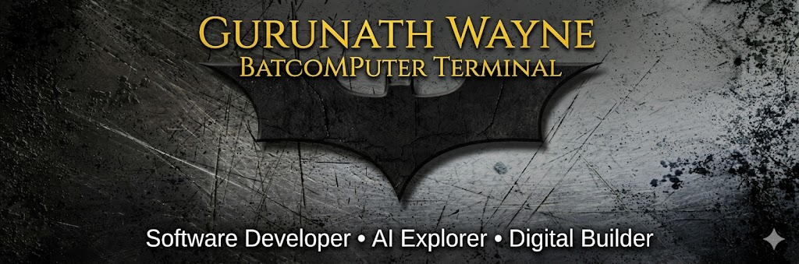

  

<h1 align="center">Kudala Srigurunath</h1>

  <b>Data Science Graduate | Data Analyst | Python, SQL, Power BI, AI and SAP BOM Validation</b>

  <a href="https://www.linkedin.com/in/srigurunath-kudala-421607359/">LinkedIn</a>
  ·
  <a href="https://github.com/Srigurunath/sap-bom-agentic-ai">Featured Project</a>

---

## About Me

I am a B.Tech Computer Science and Engineering graduate specialized in Data Science. I build practical data and AI applications using Python, SQL, pandas, Excel, Power BI, Flask, React, and IBM watsonx.ai.

My current focus is data analytics, dashboard development, AI-assisted validation systems, and automation for business reporting workflows.

## Featured Project

### SAP BOM Agentic AI Validation System

Built an AI-assisted SAP Bill of Materials validation system that processes Excel-based SAP BOM data and generates structured validation reports.

The system validates SAP BOM relationships across MAST, STKO, STAS, and STPO tables, identifies missing records, detects duplicate keys, and generates final Excel output with validation status, failed rule, severity, and recommendation fields.

Repository: [sap-bom-agentic-ai](https://github.com/Srigurunath/sap-bom-agentic-ai)

## Technical Skills

**Programming and Data:** Python, SQL, pandas, NumPy, Excel, data cleaning, data validation, exploratory data analysis

**Analytics and BI:** Power BI, dashboards, reporting, KPI tracking, charting, business insights

**AI and ML:** IBM watsonx.ai, AutoAI, machine learning basics, predictive modeling, CNNs, OpenCV

**Backend and Frontend:** Flask, REST APIs, React, Vite, TypeScript, Recharts

**Domain Exposure:** SAP BOM validation, MAST, STKO, STAS, STPO, rule-based validation, exception reporting

## What I Am Looking For

I am looking for entry-level opportunities in:

- Data Analyst
- Junior Data Analyst
- Power BI Analyst
- Data Science Intern
- AI/ML Intern
- Python Data Automation Intern

## Current Learning

- Advanced SQL for analytics
- Power BI dashboard design
- Production-ready Flask APIs
- AI-assisted data validation workflows
- GitHub portfolio development

## Contact

- LinkedIn: [srigurunath-kudala-421607359](https://www.linkedin.com/in/srigurunath-kudala-421607359/)
- GitHub: [Srigurunath](https://github.com/Srigurunath)
